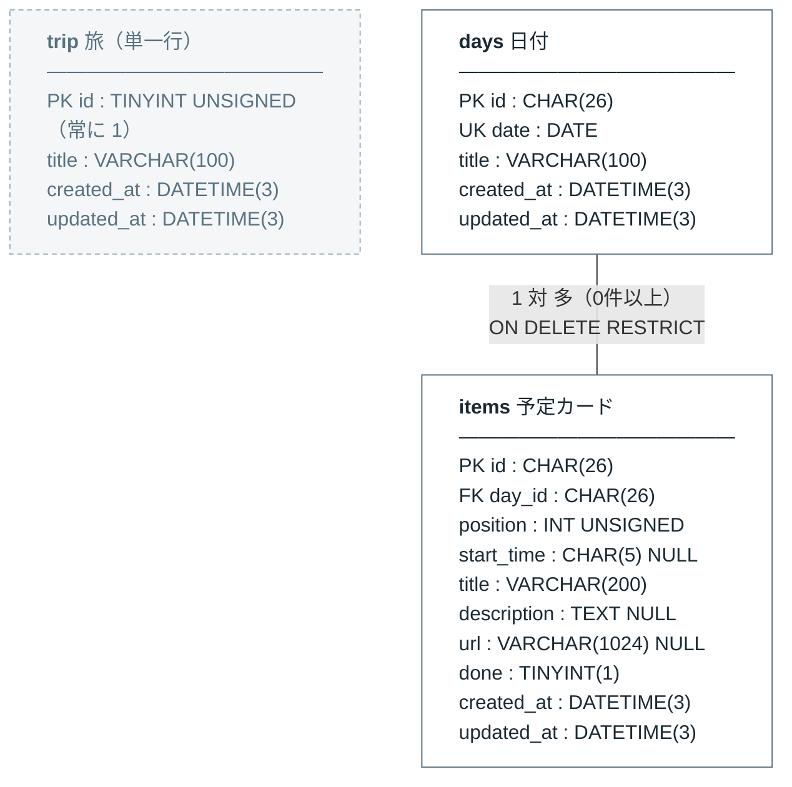

# DB 設計 — 沖縄のしおり

対象: MySQL 8.0.16 以降 / InnoDB / Go + GORM

- ER 図の原本: [erd.mmd](erd.mmd)
- マイグレーション本体: 本書の [マイグレーション](#マイグレーション) に全文を記載
- バックエンド側の設計: [../backend-design/README.md](../backend-design/README.md)

> **改訂(2026-09-07, backend 実装時)** — 認証を持たないことに決めたため `sessions` を廃止(D14 → 廃止、B10)。
> 任意項目の表現を揃えるため `items.url` を `NULL` 可に変更(D16)。並べ替えは 1 枚ずつ動かす API になったため
> 「I2 を守る処理の形」を書き換えた。

---

## 全体像



凡例: `PK` 主キー / `FK` 外部キー / `UK` 一意キー / 型のうしろに `NULL` が無いものは `NOT NULL`。
既定値・文字セット・照合順序は [マイグレーション](#マイグレーション) の DDL を参照。

**関連は `days → items` の 1 本だけ。** 破線の `trip` は他とリレーションを持たない。

- `trip` … 旅は 1 つしか存在しないので、`days` から参照する必要がない(D8)
- 認証・セッションのテーブルは無い。アプリは公開で動かす(D14 廃止、B10)

### テーブルの役割

| テーブル | 役割 | 主なポイント |
|---|---|---|
| `trip` | 旅のタイトルの置き場所 | **常に 1 行**。CHECK 制約で複数行を作れなくする(D8) |
| `days` | 日付 = カードの箱 | `date` が実体かつ並び順。並び順カラムを持たない(D1 / D3) |
| `items` | 予定カード | 居場所は `day_id` と `position` の 2 列(D5) |

## カードの「居場所」の表し方

カードは **日付という箱の中のどこにいるか** で位置が決まる。

```
days(2026-10-10)  ┌─ items[0]  10:30  那覇空港 着
                  ├─ items[1]  12:30  首里そば
                  └─ items[2]  15:00  首里城公園

days(2026-10-11)  ┌─ items[0]  09:00  美ら海水族館
                  └─ items[1]  13:30  古宇利大橋
```

| 意味 | カラム |
|---|---|
| どの箱か | `items.day_id` |
| 箱の中の何番目か | `items.position` (0 始まり、日ごとに閉じた連番) |

並び替えはすべてこの 2 列の更新として永続化する。日付を跨ぐ移動は `day_id` と
`position` の両方が変わり、同じ日の中での移動は `position` だけが変わる。
**扱いを分ける必要がない**のがこの持ち方の要点。

---

## 意思決定

### D1. 日付は `days.date` を実体として持つ

**決定** — 日付を DATE カラムとして永続化する。

**理由** — プロトタイプは日付を持たず、出発日と配列の**添字**から計算していた。

```js
// frontend/index.dc.html (廃止する)
dayDate(i) { const d = new Date(this.state.trip.start + 'T00:00:00'); d.setDate(d.getDate() + i); return d; }
```

この方式は「日程に穴を開ける」(10/10 と 10/12 だけ、など)ことが構造的に不可能で、
かつ日付が導出値なので DB 側から日付で引くこともできない。

**却下** — 添字方式の継続。表現力が足りない。

### D2. 出発日はカラムで持たない

**決定** — 出発日は `MIN(days.date)`、最終日は `MAX(days.date)` で導出する。

**理由** — D1 で `days.date` を真実にした以上、出発日を別カラムで持つと同じ情報が
2 箇所に存在してズレる。ズレても誰も気づけない。真実の源は常にひとつに保つ。
旅は最低 1 日を持つ(不変条件 I1)ので、この集約は必ず値を返す。

**却下** — 表示高速化のための非正規化。件数が数日〜十数日なので効果がない。

### D3. `days` に並び順カラムを持たない

**決定** — 日付の並び順は `ORDER BY date`。`position` 相当のカラムを置かない。

**理由** — 順序カラムを別に持つと「3 日目の日付が 2 日目より前」という、
現実には存在しない状態を DB 上で表現できてしまう。表現できる状態は少ないほどよい。
`DAY 1, 2, 3...` の表示は `date` 昇順の行番号であり、DB には持たない。

### D4. `UNIQUE (date)` を張る

**決定** — 同じ日付は 2 つ存在しない、を DB 制約で守る。

**理由** — これは業務上の真の制約であり、アプリのバグで壊れてはいけない種類のもの。
旅が 1 つしか存在しない(D8)ので、`date` 単独で一意にできる。

**トレードオフ** — 「旅程まるごと 1 週間後にずらす」機能を将来足す場合、N 行更新の
**途中で** UNIQUE と衝突しうる。MySQL に制約の遅延評価は無いため、以下のように
**1 文** かつ **更新順を指定**する必要がある。

```sql
UPDATE days SET date = date + INTERVAL ? DAY ORDER BY date DESC;
-- ORDER BY が無いと途中で重複エラーになる
```

`ORDER BY` によるこの回避策は公式ドキュメントに明記されている。
→ [MySQL 8.4 Reference Manual 15.2.17 UPDATE](https://dev.mysql.com/doc/refman/8.4/en/update.html)

### D5. カードの居場所は `(day_id, position)` の 2 列で表す

**決定** — `position` は日ごとに閉じた 0 始まりの連番とする。

**理由** — 日付を跨ぐ並び替えと日内の並び替えを、同じ更新操作で表現できる。

**却下** — 旅全体を通した通し番号(0..n)。日を跨ぐたびに全カードの再採番が必要になり、
かつ「どの日に属するか」を順番から逆算することになって `day_id` と二重管理になる。

**却下** — 小数や大きめの飛び番号による順序保持(いわゆる LexoRank 的手法)。
1 日あたり数枚〜十数枚の規模では、毎回 `0..n-1` に正規化するコストの方が小さく、
状態も単純になる。

### D6. `(day_id, position)` に UNIQUE を張らない

**決定** — 非一意インデックス `KEY idx_items_day_position (day_id, position)` に留める。

**理由** — ドラッグ確定時に複数カードの `position` が一度に入れ替わる。1 行ずつ更新すると
中間状態で必ず重複するが、MySQL は制約を文単位で評価するため回避できない(D4 と同根)。
一意性はサーバがトランザクション内で `0..n-1` に正規化して担保する(不変条件 I2)。

### D7. `items → days` の FK は `ON DELETE RESTRICT`

**決定** — 日付を削除するとき、その日のカードは事前に別の日へ退避させる。退避漏れは
FK 違反としてエラーにする。

**理由** — `CASCADE` にすると、退避漏れがあったときにカードが**黙って消える**。
`RESTRICT` なら実装ミスがその場でエラーとして露見する。
旅程アプリでデータが静かに消えるのは最悪の失敗モードなので、うるさい側に倒す。

→ [MySQL 8.4 Reference Manual 15.1.20.5 FOREIGN KEY Constraints](https://dev.mysql.com/doc/refman/8.4/en/create-table-foreign-keys.html)

### D8. 旅は単一行テーブル `trip` にする。`days` から参照しない

**決定** — 複数の旅を扱わない。`trip` は常に 1 行だけ存在するテーブルとし、
`days` に `trip_id` を持たせない。単一行であることは CHECK 制約で DB が守る。

```sql
id TINYINT UNSIGNED NOT NULL DEFAULT 1,
PRIMARY KEY (id),
CONSTRAINT ck_trip_singleton CHECK (id = 1)
```

**理由** — 旅が 1 つなら `trip_id` は全行で同じ値になる。同じ値しか入らない列は
情報を持たないので、FK ごと消してよい。結果として以下が単純になる。

- `days` が外部キーを持たない根テーブルになり、リレーションが `days → items` の 1 本だけになる
- `UNIQUE (trip_id, date)` が `UNIQUE (date)` になる(D4)
- 日付やカードを引くときに旅を特定する条件が要らなくなる

**なぜテーブルを完全に無くさないのか** — 旅のタイトル(「ふたりの沖縄」)は
「旅の設定」画面から**編集できる**([frontend/index.dc.html](../../frontend/index.dc.html) の
`旅のタイトル` 入力)。書き換わる値なので設定ファイルや環境変数には置けず、
どこかに永続化する行が要る。

**却下** — `settings` のようなキー・バリュー表に 1 行入れる。型が効かず、
「とりあえずここに入れておく」が積み上がる置き場になりやすい。
今は列が `title` ひとつでも、型の付いたテーブルにしておく。

**将来** — 複数の旅を扱いたくなったら、`trip` を `trips` に戻して `days.trip_id` と
FK を足し、`UNIQUE (date)` を `UNIQUE (trip_id, date)` に変える。
そのときに必要なマイグレーションであって、今書くものではない。

**注意** — CHECK 制約が実際に**強制される**のは MySQL 8.0.16 以降。それ以前は
構文が受理されるだけで無視される。
→ [MySQL 8.4 Reference Manual 15.1.20.6 CHECK Constraints](https://dev.mysql.com/doc/refman/8.4/en/create-table-check-constraints.html)

### D9. `done` はカードの属性。`users` テーブルを作らない

**決定** — チェック状態はふたりで共有する 1 つの真偽値。

**理由** — バックエンドに認証は無く(B10)、「ふたりの記念日」による入口の判定はフロントだけで行う。
つまりシステムは利用者を識別していない。識別していない以上、
ユーザーごとの状態は持てないし、持つ意味もない。

**将来** — 「どちらがチェックしたか」を出したくなったら、そのときに `users` と
`item_checks` を足す。今は入れない。

### D10. 識別子列は `ascii` + `_bin`、本文は `utf8mb4`

**決定** — ULID を入れる列、すなわち `days.id` / `items.id` / `items.day_id` を
`CHARACTER SET ascii COLLATE ascii_bin` にする。

**理由** — これは容量最適化ではなく**正しさ**の問題。既定の `utf8mb4_0900_ai_ci` は
大文字小文字を区別しないため、`01H...` と `01h...` が**同じ値として扱われる**。
ULID は Crockford Base32 で、大小の違う 2 つの ID が衝突扱いになるのは事故のもと。
`_bin` なら完全一致で比較される。副次的に 1 文字 4 バイト → 1 バイトになり
インデックスも小さくなる。

**注意** — FK は親子で文字セット・照合順序が一致していないと作成できない。
`days.id` と `items.day_id` は必ず同じ指定にすること。

本文(`title` / `description` / `url`)は絵文字が入るので `utf8mb4` のまま。

### D11. カラム名は `position`(`order` ではない)

**決定** — DB のカラム名は `position`。

**理由** — `ORDER` は MySQL の**予約語**。バッククォートで囲えば使えるが、クエリを書く
たびに事故る。一方 `DATE` と `POSITION` は非予約語なので、そのまま識別子に使える。

→ [MySQL 8.0 Keywords and Reserved Words](https://dev.mysql.com/doc/mysqld-version-reference/en/keywords-8-0.html)

### D12. `days` / `items` の主キーは ULID (`CHAR(26)`)

**決定** — フロントが握って扱う `days` / `items` の主キーを ULID にする。
AUTO_INCREMENT は使わない。

**理由**

- 採番のために INSERT の完了を待たなくてよい。アプリ側で先に ID を決められるので、
  親と子をまとめて組み立ててから 1 トランザクションで流せる
- 辞書順が生成時刻順になる(ULID は先頭 10 文字がタイムスタンプ)ので、
  ログや DB を目で追うときに時系列が分かる
- 件数や作成間隔を外部から推測されない

`trip.id` はこれに含まれない。あれは識別子ではなく**単一行を強制するための固定値**で、
常に `1` しか入らないため `TINYINT UNSIGNED` で足りる(D8)。

**「InnoDB で文字列 PK は避けるべきでは」について** — 一般論としては正しい。InnoDB の
主キーはクラスタ索引なので、UUIDv4 のようなランダム値だと挿入位置が散らばって
ページ分割が多発する。**ただし ULID にはこの問題が当てはまらない。**
先頭 10 文字がタイムスタンプで、Crockford Base32 の英数字集合
`0123456789ABCDEFGHJKMNPQRSTVWXYZ` は ASCII の並び順が値の並び順と一致する。
つまり `ascii_bin`(D10)での辞書順 = 生成時刻順になり、挿入はほぼ末尾追記で済む。
→ [ULID Spec](https://github.com/ulid/spec)

### D13. `start_time` は表示専用。並び順に関与させない

**決定** — `CHAR(5)` で `'HH:MM'`。NULL は「時間未定」。`ORDER BY` には使わない。

**理由** — 時刻が未定のカードを許容しているし、手動で時系列と違う順に並べたい場面もある。
「順番は人が決める、時刻は表示するだけ」と役割を分ける。

**却下** — `TIME` 型。`'HH:MM:SS'` で返ってくるため表示のたびに変換が要る。
SQL 上で時刻演算する要件が皆無なので、扱いが素直な `CHAR(5)` を採る。

### D14. ~~セッションはトークンのハッシュのみ保存する~~ → 廃止

**廃止(2026-09-07)** — バックエンドに認証を持たないことにした(B10)。
しおりに秘密の情報は無く、URL を知っているふたりだけが使う前提で公開でよい、という判断。
「ふたりの記念日」による入口の演出はフロントだけで行い、`frontend/api.js` の `ANNIVERSARY` 定数は**残す**。

これに伴い `sessions` テーブルとマイグレーション `000004_create_sessions` は作らない。
当初の案(トークンの SHA-256 のみ DB に置く、合言葉は環境変数)は、認証を足したくなった時の出発点として
[backend-design の B10](../backend-design/README.md#b10-認証を持たない) に記録してある。

### D15. マイグレーションは 1 ファイル 1 テーブル

**決定** — [golang-migrate](https://github.com/golang-migrate/migrate) 形式で、
1 マイグレーション = 1 ステートメントにする。

**理由** — MySQL の DDL は暗黙コミットを起こすためトランザクションで巻き戻せない。
1 ファイルに複数の DDL を入れると、途中で失敗したときに中途半端な状態が残る。
また go-sql-driver/mysql は既定で複数ステートメントを拒否する
(`multiStatements=true` が必要)ため、1 文に保てば DSN の設定にも依存しない。

**GORM の AutoMigrate は使わない** — 生成される DDL を制御できず、
D4 / D6 / D8 / D10 のような「意図的にこう張る / 張らない」という設計判断を表現できない。
スキーマの真実はこのマイグレーションファイル群に置き、GORM は構造体を合わせる側に回る。

**適用方法** — SQL は Go バイナリに `go:embed` で同梱し、起動時に未適用ぶんを流す(B4)。
`migrate` CLI は不要。

### D16. 任意項目は `NULL` で「未設定」を表す。API では `""`

**決定** — `items` の任意 3 項目 `start_time` / `description` / `url` はすべて `NULL` 可とし、
「未設定」を `NULL` で表す。`NOT NULL DEFAULT ''` は使わない。

**理由** — 当初 `url` だけ `NOT NULL DEFAULT ''` だったが、同じ「未設定」を列によって
`''` と `NULL` の 2 通りで表すと、扱いが列ごとに分岐する。3 列を同じ規則に揃える。

**API との対応** — API では `null` を使わず、`""` を「未設定」とする(B2)。
差分 API で `*string` を使うと「キーが無い」と「`null`」がどちらも `nil` になって区別できないため。
サーバが `""` ↔ `NULL` を変換し、変換箇所は repository の 1 ファイルに閉じる。

---

## マイグレーション

配置先: `backend/migrations/`

```
backend/migrations/
├── embed.go                        # go:embed *.sql
├── 000001_create_trip.up.sql
├── 000001_create_trip.down.sql
├── 000002_create_days.up.sql
├── 000002_create_days.down.sql
├── 000003_create_items.up.sql
└── 000003_create_items.down.sql
```

FK は `items → days` の 1 本だけなので、順序の制約は `days` を `items` より先に作ることのみ。
`down` はバージョン降順に適用されるため、`items` が先に落ちて FK 違反にならない。

### `000001_create_trip.up.sql`

```sql
-- 旅は 1 つしか存在しない。この表は常に 1 行だけ持つ(D8)
CREATE TABLE trip (
  -- 識別子ではなく単一行を強制するための固定値。常に 1
  id         TINYINT UNSIGNED NOT NULL DEFAULT 1,
  title      VARCHAR(100)     NOT NULL DEFAULT '',
  created_at DATETIME(3)      NOT NULL DEFAULT CURRENT_TIMESTAMP(3),
  updated_at DATETIME(3)      NOT NULL DEFAULT CURRENT_TIMESTAMP(3)
                              ON UPDATE CURRENT_TIMESTAMP(3),
  PRIMARY KEY (id),
  -- 2 行目を作れなくする。MySQL 8.0.16 以降で強制される
  CONSTRAINT ck_trip_singleton CHECK (id = 1)
) ENGINE=InnoDB
  DEFAULT CHARSET=utf8mb4
  COLLATE=utf8mb4_0900_ai_ci;
```

### `000001_create_trip.down.sql`

```sql
DROP TABLE IF EXISTS trip;
```

### `000002_create_days.up.sql`

```sql
CREATE TABLE days (
  -- ULID。大小を区別するため ascii_bin(D10 / D12)
  id         CHAR(26) CHARACTER SET ascii COLLATE ascii_bin NOT NULL,
  -- 日付の実体。並び順もこの列で決まる(D1 / D3)
  date       DATE         NOT NULL,
  -- その日のテーマ。例: 美ら海と古宇利島
  title      VARCHAR(100) NOT NULL DEFAULT '',
  created_at DATETIME(3)  NOT NULL DEFAULT CURRENT_TIMESTAMP(3),
  updated_at DATETIME(3)  NOT NULL DEFAULT CURRENT_TIMESTAMP(3)
                          ON UPDATE CURRENT_TIMESTAMP(3),
  PRIMARY KEY (id),
  -- 同じ日付は 2 つ存在しない(D4)。旅が 1 つなので date 単独で一意にできる
  UNIQUE KEY uq_days_date (date)
) ENGINE=InnoDB
  DEFAULT CHARSET=utf8mb4
  COLLATE=utf8mb4_0900_ai_ci;
```

`uq_days_date` は日付順取得 (`ORDER BY date`) にもそのまま効くので、
並び順のための索引を別に張る必要はない。

### `000002_create_days.down.sql`

```sql
DROP TABLE IF EXISTS days;
```

### `000003_create_items.up.sql`

```sql
CREATE TABLE items (
  -- ULID。大小を区別するため ascii_bin(D10 / D12)
  id          CHAR(26) CHARACTER SET ascii COLLATE ascii_bin NOT NULL,
  -- 居場所その1: どの日付の箱に入っているか(D5)
  -- FK のため days.id と文字セット・照合順序を一致させること
  day_id      CHAR(26) CHARACTER SET ascii COLLATE ascii_bin NOT NULL,
  -- 居場所その2: 箱の中で上から何番目か。0 始まり、日ごとに閉じた連番(D5)
  position    INT UNSIGNED  NOT NULL,
  -- 'HH:MM' / NULL = 時間未定。表示専用で並び順には使わない(D13)
  start_time  CHAR(5)       NULL,
  title       VARCHAR(200)  NOT NULL,
  -- 任意項目は NULL で「未設定」を表す(D16)
  description TEXT          NULL,
  url         VARCHAR(1024) NULL,
  -- チェック済み。ふたりで共有する(D9)
  done        TINYINT(1)    NOT NULL DEFAULT 0,
  created_at  DATETIME(3)   NOT NULL DEFAULT CURRENT_TIMESTAMP(3),
  updated_at  DATETIME(3)   NOT NULL DEFAULT CURRENT_TIMESTAMP(3)
                            ON UPDATE CURRENT_TIMESTAMP(3),
  PRIMARY KEY (id),
  -- 一括入れ替えの中間状態で重複するため、意図的に非一意(D6)
  KEY idx_items_day_position (day_id, position),
  -- 退避漏れでカードが黙って消えないよう RESTRICT(D7)
  CONSTRAINT fk_items_day FOREIGN KEY (day_id)
    REFERENCES days (id) ON DELETE RESTRICT ON UPDATE RESTRICT
) ENGINE=InnoDB
  DEFAULT CHARSET=utf8mb4
  COLLATE=utf8mb4_0900_ai_ci;
```

### `000003_create_items.down.sql`

```sql
DROP TABLE IF EXISTS items;
```

### 適用メモ

- **必要バージョン** — MySQL 8.0.16 以降。`utf8mb4_0900_ai_ci` が 8.0 から、
  CHECK 制約の強制(D8)が 8.0.16 から。それ未満で動かす必要が出た場合、
  照合順序は `utf8mb4_unicode_ci` に読み替えられるが、**CHECK は黙って無視される**ので
  単一行の保証をアプリ側に移す必要がある。
- **タイムスタンプの既定値** — GORM が `CreatedAt` / `UpdatedAt` を自分で埋めるため、
  通常は DB 既定値もこの `ON UPDATE` も発火しない。手で SQL を流したときや
  GORM を経由しない経路のための保険として置いている。
- **初期データはマイグレーションに含めない** — 「今日の日付で 1 日ぶん作る」という
  内容が適用日時に依存するため、再現性のあるマイグレーションにならない。
  アプリ起動時のブートストラップ処理で行う(後述)。

---

## 不変条件

DB 制約だけでは守れず、アプリ側がトランザクション内で保証すること。

| | 内容 | 補足 |
|---|---|---|
| **I1** | `days` は常に 1 件以上ある | 最後の 1 日は削除させない。D2 の `MIN` / `MAX` 導出がこれに依存する |
| **I2** | `items.position` は日付ごとに `0..n-1` の連番 | 書き込み処理の完了時点で常に正規化済み(D6) |
| **I3** | 孤児カードは存在しない | 日付の削除時、カードが残っていれば 409 で拒否する。`?withItems=true` のときだけ同じトランザクションでカードを先に消す(D7、B9) |
| **I4** | 同時編集は後勝ち | ふたりが同時に同じカードを触ると片方の結果が消える。**今回は許容する**(B11)。調査用に全テーブルへ `updated_at` を持たせている |

`date` の一意性(D4)と `trip` が 1 行であること(D8)は DB 制約で守るため、ここには含めない。

### I2 を守る処理の形

並べ替えは **1 リクエストで 1 枚だけ**動かす(B6)。以下を 1 トランザクションで行う。

1. 動かすカードを読み、`day_id` と本文の差分を適用して書き戻す
2. 移動先の日で、**自分を除いた**カード ID を `ORDER BY position, id` で取り、指定位置に自分を挿入し、
   添字をそのまま `position` として 1 行ずつ書く(`PlaceAt`)
3. 日を跨いだ場合は移動元の日も `0..n-1` に振り直す(`Renumber`)
4. コミット

「自分を除いた並びに挿入する」のは、同じ日の中で後ろへ動かすとき、自分が抜けた穴のぶんだけ位置が
ずれる問題を避けるため(A,B,C で A を 2 番目へ → 期待は B,C,A)。
カードの削除後も 3 と同じ振り直しを行う。1 行ずつ更新できるのは D6 で非一意にしてあるから。

---

## 初期データ

DB が空の場合に、アプリ起動時のブートストラップで用意するもの。

| テーブル | 内容 |
|---|---|
| `trip` | `id = 1`, `title = ''` の 1 行 |
| `days` | **今日の日付**で 1 件(不変条件 I1 を満たすため) |
| `items` | なし |

## 想定クエリ

主要な参照は 3 本だけ。どれも既存のインデックスで賄える。

```sql
-- 旅のタイトル
SELECT * FROM trip WHERE id = 1;

-- 日付の一覧
SELECT * FROM days ORDER BY date;
--   → uq_days_date (date) がそのまま効く

-- 全カードを表示順に取得
SELECT i.* FROM items i
  JOIN days d ON d.id = i.day_id
 ORDER BY d.date, i.position;
--   → days 側は uq_days_date、items 側は idx_items_day_position が効く
```

件数は多くても日付が十数件、カードが数十件の規模なので、
これ以上の索引追加や非正規化は現時点で不要。
